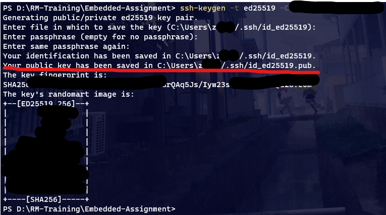
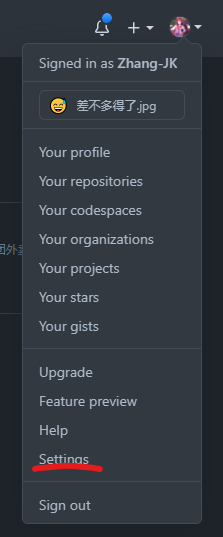
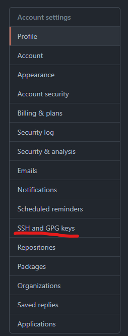
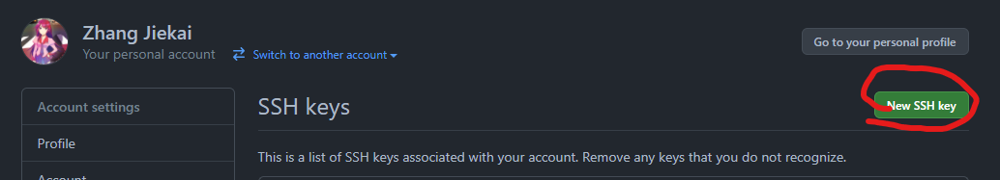
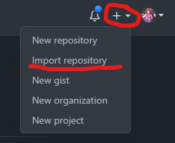
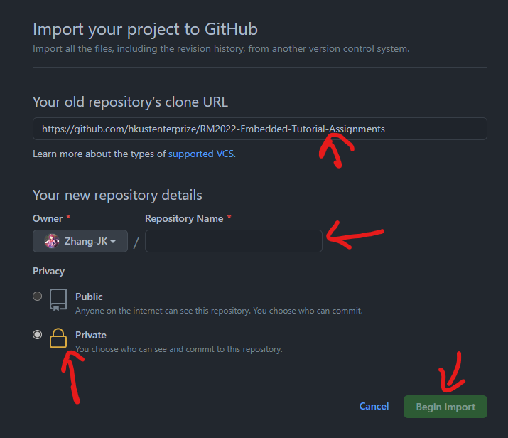
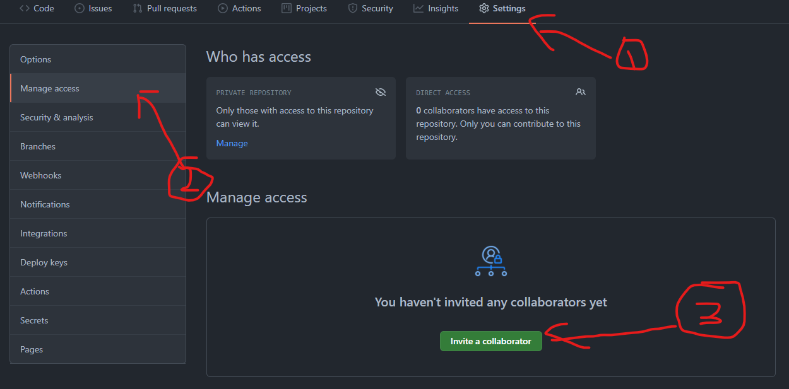

# Assignment0 - Git

Before doing this assignment, you need to know the following git operations:

- **init** the git repo and connect to **remote** repo
- **add** and **commit** files
- **push** to the remote repo
- using GitHub

## set up your local git
1. go to [here](https://git-scm.com/downloads) to download your git client  
2. run the following two line to config your local git  
```bash
# remember to modify the email and name 👇
git config --global user.email "you@example.com"
git config --global user.name "Your Name"
```

## connect to GitHub
1. Generate the ssh key
    run this command: ```ssh-keygen -t ed25519 -C "your_email@example.com"``` remember to modify the email  
    after you run the code it will tell you where is the generated file(see the image below)  
    
2. Copy your public key
    open the public key file and copy all things in it  
3. Paste to GitHub
    go to settings -> SSH and GPG keys -> New SSH Key  
    set your own title and paste the public key there  
      

If failed, please go through the following link and try again  
- [Generating a new SSH key](https://docs.github.com/en/github/authenticating-to-github/connecting-to-github-with-ssh/generating-a-new-ssh-key-and-adding-it-to-the-ssh-agent)
- [Adding SSH key to your GitHub account](https://docs.github.com/en/github-ae@latest/github/authenticating-to-github/connecting-to-github-with-ssh/adding-a-new-ssh-key-to-your-github-account)

## get the remote repo

1. Import our assignment repository and make it private (follow the image below)  
      
      
2. Clone your own repo to local (or download zip)
3. Fill in your infomation(name, itsc email and student ID) in the README.md in root path
4. **Add the following TAs as a collaborator (IMOPRTANT!!!)**:
    - [Zhang-JK](https://github.com/Zhang-JK)
    - [CHENGEZ](https://github.com/CHENGEZ)
    - [IKEMURA, Kei](https://github.com/Ikemura-kei)
    
## commit and push

- You need to submit all you code on github, and we will grade it.
- Please arrange your commits reasonably and attach appropriate commit message
- Push your code before DDL
