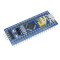

# Assignment4

Before doing this assignment, you should already know the following things:

- What is CubeMX and how to use it
- What is HAL library
- Compile and download your code
- How to use GPIO with HAL library

## Embedded programming exercise

### Task
This week, you need to turn on a LED with STM32F103 development board. (As the image below)    
  
The LED on it is connected to PC13 (Port C, Pin 13), you need to make the lights flash (Constantly open and close)

### API 
You may need the following APIs from HAL library to finish this task:  
- HAL_GPIO_WritePin
- HAL_GPIO_TogglePin
- HAL_Delay  

### Useful links:  
- [STM32 GPIO Write Pin Digital Output LAB](https://deepbluembedded.com/stm32-gpio-write-pin-digital-output-lab/)
- [Description of STM32F1 HAL and low-layer drivers](https://www.st.com/resource/en/user_manual/dm00154093-description-of-stm32f1-hal-and-lowlayer-drivers-stmicroelectronics.pdf)

### Demo
Show your flashing light to any of our TA then you will get full mark.